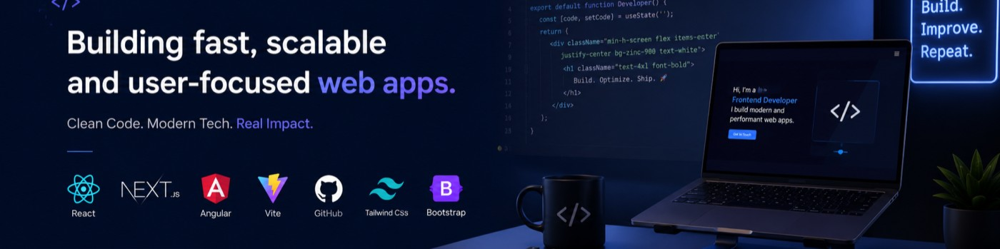

# Hi 👋, I'm Sharath Chandra Mengani

### Frontend Engineer • React • Next.js • Angular

Building fast, scalable, and user-focused web experiences.

- 🚀 Currently building modern web applications
- 🌱 Exploring system design and AI-powered products
- 💡 Passionate about performance, accessibility, and DX
- 📍 India

---

## ⚡ Tech Arsenal

### Frontend

  

### State Management

  Redux Toolkit • TanStack Query • Zustand • NgRx • Context API

### Tools

  

---

## 🔥 Current Focus

✓ Advanced React Patterns
✓ Frontend Architecture
✓ Scalable Design Systems
✓ Open Source Contributions
✓ AI-integrated Applications

## 🔥 Current Goals

- Advanced React Patterns
- Production-Ready SaaS Apps
- Open Source Contributions
- Frontend Architecture

## 📫 Connect

